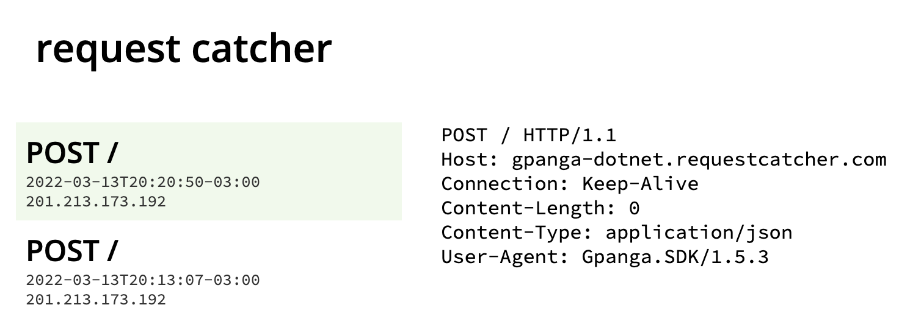

# Example of DotNet SDK

This is an SDK example created using C# DotNet. Tested, deployed and publish to Nuget using GitHub Actions.


## Key Features

This project is just a demostration to see how to create a DotNet SDK with two major features.

### Automatic Semantic Releases

This project has `Semantic Release` npm dependency available to provide automatic semantic releases thorugh GitHub Actions, everytime a new commit is pushed to `main`.

This generates:

- A Release in GitHub containing the released commits & the tag.
- A new version in Nuget registry.

### Tracking version

When working with SDK libraries that access our API, we need to track the version of the SDK of our users. This is useful to understand issues or possible breaking changes that could affect customers.

This project implements a quick solution to track the version through the `User-Agent` header using the project's version.



To keep this value updated, I have configured a script that after each relaese its made it runs automatically an update on the project's versions with the latest release.

This is done by the `@semantic-release/exec` command that prepeares the release.

```
./updateVersion.sh '${nextRelease.version}'
```

## Configuration

You have to configure your GitHub repository with the following secrets:

- `NUGET_PUSH_URL`: Url to push the nuget package.
- `NUGET_TOKEN`: Nuget authorization token available to create new versions.


